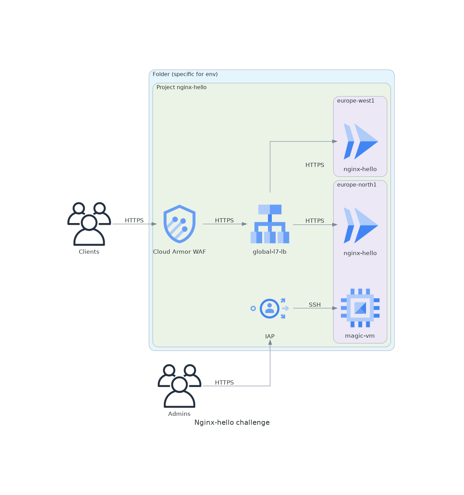

# About
In this repo you will find Terraform code that deloys the following infrastrusture elements:
- GCP project in specified folder
- Cloud Run service for nginx-hello containerized application
- Cloud Endpoint gateway to get `xxx.cloud.goog` DNS record
- Google-managed SSL certificate for `xxx.cloud.goog` name
- Global L7 load-balancer that provides external access to the Cloud Run serverless NEG
- WAF service based on Cloud Armor policy attached to the load-balancer 
- Sample Compute Engine VM with IAP access (for demonstration)

# Diagram



# How to use
## Dev
```
terraform init -backend-config="bucket=cl-challenge-dev"
terraform apply -var-file=vars/dev.tfvars
```
## Stage
```
terraform init -backend-config="bucket=cl-challenge-stage"
terraform apply -var-file=vars/stage.tfvars
```
## Prod
```
terraform init -backend-config="bucket=cl-challenge-prod"
terraform apply -var-file=vars/prod.tfvars
```

# Details
<!-- BEGIN_TF_DOCS -->
## Requirements

| Name | Version |
|------|---------|
| <a name="requirement_google"></a> [google](#requirement\_google) | =4.52.0 |
| <a name="requirement_google-beta"></a> [google-beta](#requirement\_google-beta) | =4.52.0 |

## Providers

| Name | Version |
|------|---------|
| <a name="provider_google"></a> [google](#provider\_google) | 4.52.0 |
| <a name="provider_google-beta"></a> [google-beta](#provider\_google-beta) | 4.52.0 |
| <a name="provider_random"></a> [random](#provider\_random) | 3.4.3 |
| <a name="provider_terraform"></a> [terraform](#provider\_terraform) | n/a |

## Modules

| Name | Source | Version |
|------|--------|---------|
| <a name="module_cloud-ep-dns"></a> [cloud-ep-dns](#module\_cloud-ep-dns) | terraform-google-modules/endpoints-dns/google | n/a |
| <a name="module_cloud_armor"></a> [cloud\_armor](#module\_cloud\_armor) | GoogleCloudPlatform/cloud-armor/google | n/a |
| <a name="module_gce-lb-http"></a> [gce-lb-http](#module\_gce-lb-http) | GoogleCloudPlatform/lb-http/google | 7.0.0 |
| <a name="module_project-nginx-hello"></a> [project-nginx-hello](#module\_project-nginx-hello) | git@github.com:pavelrn/cl-challenge-base-project.git | v1.5 |

## Resources

| Name | Type |
|------|------|
| [google-beta_google_cloud_run_service.nginx-hello](https://registry.terraform.io/providers/hashicorp/google-beta/4.52.0/docs/resources/google_cloud_run_service) | resource |
| [google-beta_google_compute_global_address.lb-fe-ip](https://registry.terraform.io/providers/hashicorp/google-beta/4.52.0/docs/resources/google_compute_global_address) | resource |
| [google_cloud_run_service_iam_member.all_users](https://registry.terraform.io/providers/hashicorp/google/4.52.0/docs/resources/cloud_run_service_iam_member) | resource |
| [google_compute_firewall.default](https://registry.terraform.io/providers/hashicorp/google/4.52.0/docs/resources/compute_firewall) | resource |
| [google_compute_instance.magic-vm](https://registry.terraform.io/providers/hashicorp/google/4.52.0/docs/resources/compute_instance) | resource |
| [google_compute_region_network_endpoint_group.cloudrun_neg](https://registry.terraform.io/providers/hashicorp/google/4.52.0/docs/resources/compute_region_network_endpoint_group) | resource |
| [google_service_account.cloudrun_sa](https://registry.terraform.io/providers/hashicorp/google/4.52.0/docs/resources/service_account) | resource |
| [google_service_account.vm_sa](https://registry.terraform.io/providers/hashicorp/google/4.52.0/docs/resources/service_account) | resource |
| [random_id.suffix](https://registry.terraform.io/providers/hashicorp/random/latest/docs/resources/id) | resource |
| [google_compute_zones.available](https://registry.terraform.io/providers/hashicorp/google/4.52.0/docs/data-sources/compute_zones) | data source |
| [terraform_remote_state.infra](https://registry.terraform.io/providers/hashicorp/terraform/latest/docs/data-sources/remote_state) | data source |

## Inputs

| Name | Description | Type | Default | Required |
|------|-------------|------|---------|:--------:|
| <a name="input_app_name"></a> [app\_name](#input\_app\_name) | Application name | `string` | n/a | yes |
| <a name="input_billing_account"></a> [billing\_account](#input\_billing\_account) | Billing account ID | `string` | n/a | yes |
| <a name="input_env"></a> [env](#input\_env) | Short environment name (dev, stage, prod) | `string` | n/a | yes |
| <a name="input_folder_id"></a> [folder\_id](#input\_folder\_id) | Parent folder ID | `string` | n/a | yes |
| <a name="input_project_ip_cidr_range"></a> [project\_ip\_cidr\_range](#input\_project\_ip\_cidr\_range) | Project IP /24 subnet (subnet is used for different services internally) | `string` | n/a | yes |
| <a name="input_region"></a> [region](#input\_region) | Region to deploy infrastructure and applications | `string` | n/a | yes |

## Outputs

| Name | Description |
|------|-------------|
| <a name="output_message"></a> [message](#output\_message) | Convenience message |
<!-- END_TF_DOCS -->