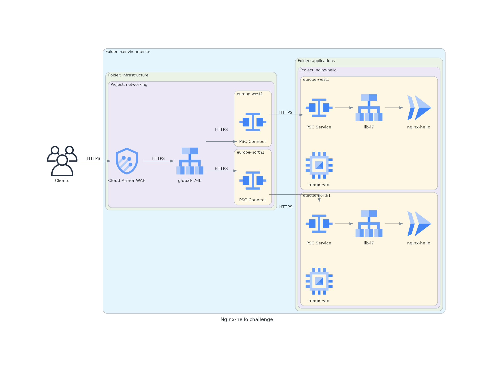

# About
This solution deploys `nginx-hello` application in a `nginx-hello` GCP project. Infrastructure elements (load balancers, DNS, certificated) are placed in a separate `networking` project managed in another `infra` repository. The connectivity from `networking` project into `nginx-hello` application project is provided with the help of Private Service Connect (PSC). 

In this repo you will find Terraform code that deloys the following infrastrusture elements:
- `nginx-hello` applicaton GCP project in specified `application` folder
- Cloud Run service for nginx-hello containerized application
- Google-managed SSL certificate for internal load balancer
- Internal load balancer
- PSC service endpoint
- Sample Compute Engine VM with IAP access (for demonstration)

# Diagram



# How to use
## Dev
```
terraform init -backend-config="bucket=cl-challenge-dev"
terraform apply -var-file=vars/dev.tfvars
```
## Stage
```
terraform init -backend-config="bucket=cl-challenge-stage"
terraform apply -var-file=vars/stage.tfvars
```
## Prod
```
terraform init -backend-config="bucket=cl-challenge-prod"
terraform apply -var-file=vars/prod.tfvars
```
## Load balancer endpoint
Check Terraform output to find out what is the load balancer endpoint.

# Details
<!-- BEGIN_TF_DOCS -->
## Requirements

| Name | Version |
|------|---------|
| <a name="requirement_google"></a> [google](#requirement\_google) | =4.52.0 |
| <a name="requirement_google-beta"></a> [google-beta](#requirement\_google-beta) | =4.52.0 |

## Providers

| Name | Version |
|------|---------|
| <a name="provider_google"></a> [google](#provider\_google) | 4.52.0 |
| <a name="provider_google-beta"></a> [google-beta](#provider\_google-beta) | 4.52.0 |
| <a name="provider_terraform"></a> [terraform](#provider\_terraform) | n/a |

## Modules

| Name | Source | Version |
|------|--------|---------|
| <a name="module_ilb"></a> [ilb](#module\_ilb) | ./modules/https-ilb | n/a |
| <a name="module_project"></a> [project](#module\_project) | github.com/cl-challenge-me/cl-challenge-base-project | v1.6 |

## Resources

| Name | Type |
|------|------|
| [google-beta_google_cloud_run_service.nginx-hello](https://registry.terraform.io/providers/hashicorp/google-beta/4.52.0/docs/resources/google_cloud_run_service) | resource |
| [google_cloud_run_service_iam_member.all_users](https://registry.terraform.io/providers/hashicorp/google/4.52.0/docs/resources/cloud_run_service_iam_member) | resource |
| [google_compute_firewall.default](https://registry.terraform.io/providers/hashicorp/google/4.52.0/docs/resources/compute_firewall) | resource |
| [google_compute_instance.magic-vm](https://registry.terraform.io/providers/hashicorp/google/4.52.0/docs/resources/compute_instance) | resource |
| [google_compute_region_network_endpoint_group.cloudrun_neg](https://registry.terraform.io/providers/hashicorp/google/4.52.0/docs/resources/compute_region_network_endpoint_group) | resource |
| [google_compute_service_attachment.producer_service_attachment](https://registry.terraform.io/providers/hashicorp/google/4.52.0/docs/resources/compute_service_attachment) | resource |
| [google_compute_subnetwork.psc_producer_subnet](https://registry.terraform.io/providers/hashicorp/google/4.52.0/docs/resources/compute_subnetwork) | resource |
| [google_service_account.cloudrun_sa](https://registry.terraform.io/providers/hashicorp/google/4.52.0/docs/resources/service_account) | resource |
| [google_service_account.vm_sa](https://registry.terraform.io/providers/hashicorp/google/4.52.0/docs/resources/service_account) | resource |
| [google_compute_zones.available](https://registry.terraform.io/providers/hashicorp/google/4.52.0/docs/data-sources/compute_zones) | data source |
| [terraform_remote_state.infra](https://registry.terraform.io/providers/hashicorp/terraform/latest/docs/data-sources/remote_state) | data source |

## Inputs

| Name | Description | Type | Default | Required |
|------|-------------|------|---------|:--------:|
| <a name="input_app_name"></a> [app\_name](#input\_app\_name) | Application name | `string` | n/a | yes |
| <a name="input_billing_account"></a> [billing\_account](#input\_billing\_account) | Billing account ID | `string` | n/a | yes |
| <a name="input_env"></a> [env](#input\_env) | Short environment name (dev, stage, prod) | `string` | n/a | yes |
| <a name="input_folder_id"></a> [folder\_id](#input\_folder\_id) | Parent folder ID | `string` | n/a | yes |
| <a name="input_proxy_ip_cidr_range"></a> [proxy\_ip\_cidr\_range](#input\_proxy\_ip\_cidr\_range) | Project IP range used for proxy-only subnets, le /24 (IP range is split across regions) | `string` | n/a | yes |
| <a name="input_regions"></a> [regions](#input\_regions) | Regions to deploy applications | `list(any)` | n/a | yes |
| <a name="input_vm_ip_cidr_range"></a> [vm\_ip\_cidr\_range](#input\_vm\_ip\_cidr\_range) | Project IP range used for VMs, le /24 (IP range is split across regions) | `string` | n/a | yes |

## Outputs

No outputs.
<!-- END_TF_DOCS -->